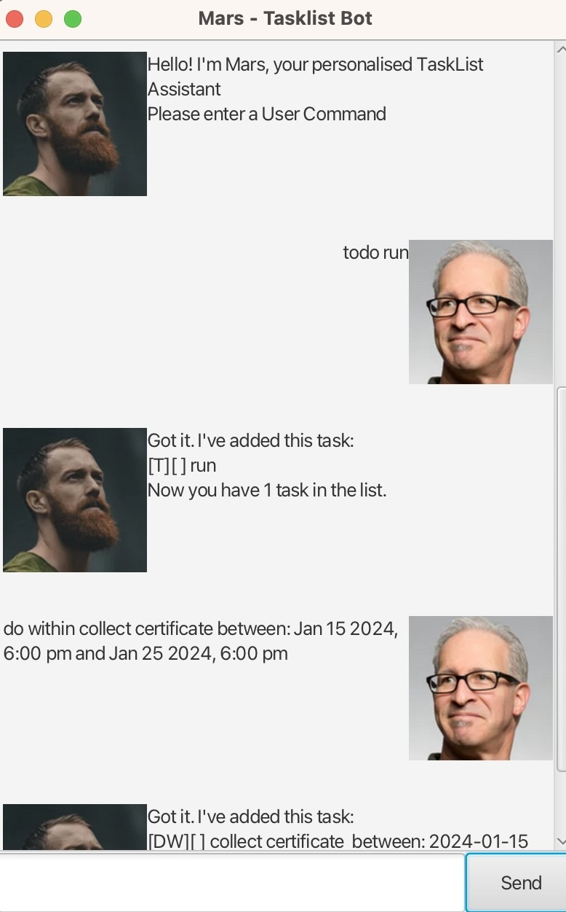

# Mars User Guide

Introducing *MARS*! A personal tasklist chatbot to help you better organise your day

Ever get overwhelmed with Deadlines, Events, ToDos, and DoWithins?   
Here is an assistant with a minimalist UI for you! 😄

# Sneak Peek
- [X] Adding Deadlines  
- [X] Marking Tasks  
- [ ] Reminders *coming soon*

## Get started
Download the .jar file of your desired version.  
Double-click and open file.  
The application is ready for use! Start adding tasks and performing other actions.  

## Here are the types of Tasks available:
* Todo
* Deadline
* Event
* Do Within *a certain time period*

## To add a Todo:
format: todo  {task name}  
*e.g. todo read book*

## To add a deadline:
format: deadline  {task name}  (by: MMM dd yyyy, h:mm a)  
*e.g. deadline return book (by: Feb 02 2024, 6:00 pm)*

## To add an Event:
format: event  {task name}  (from: MMM dd yyyy, h:mm a to MMM dd yyyy, h:mm a)  
*e.g. event CS2103T project meeting (from: Feb 28 2024, 6:00 am to: Mar 03 2024, 8:00 am)*

## To add a DoWithin, run:
format: do within  {task name}  between: MMM dd yyyy, h:mm a and MMM dd yyyy, h:mm a  
*e.g. collect certificate between: Jan 15 2024, 6:00 pm and Jan 25 2024, 6:00 pm*

## If tasks are added successfully, the output would be:

> Got it. I've added this task:  
> [T][ ] read book  
> Now you have 1 task in the list  

> Got it. I've added this task:  
> [D][ ] deadline return book by 2024-02-02 18:00  
> Now you have 2 tasks in the list  

> Got it. I've added this task:  
> [E][ ] CS2103T project meeting from: 2024-02-28 06:00 to 2024-03-03 08:00  
> Now you have 3 tasks in the list  

> Got it. I've added this task:  
> [DW][ ] collect certificate between: 2024-01-15 18:00 and 2024-01-25 18:00  
> Now you have 4 tasks in the list  

## Features:

### Deleting a task
Format: delete {task number} 
*eg. delete 1*
> Noted. I have removed this task [T][ ] read book  
> Now you have 3 tasks in the list

### Marking a task
Format: mark {task number} 
*eg. mark 1*
> Nice! I've marked this task as done: [T][X] read book   

### Unmarking a task
Format: unmark {task number} 
*eg. unmark 1*
> OK, I've marked this task as not done yet: [T][ ] read book    

### List
Format: list 
*e.g. list*
> Here are the tasks in your list:  
> [T][ ] read book  
> [DW][ ] collect certificate between: 2024-01-15 18:00 and 2024-01-25 18:00    

### Find a task through keyword
Format: find {keyword} 
*eg. find book*
> Here are the matching tasks in your list:  
> [T][ ] read book  
